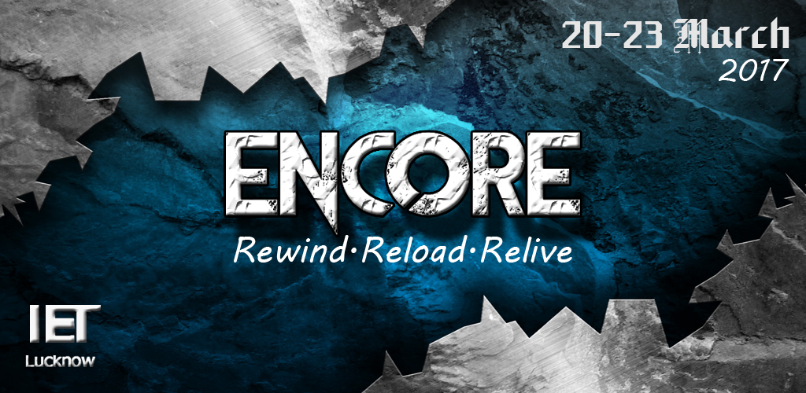
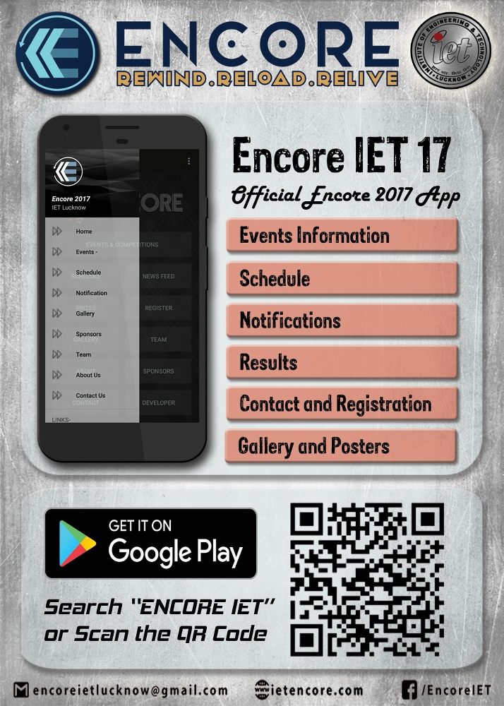

# Encore - IET Lucknow Official Fest App 2017
 
<a href="https://play.google.com/store/apps/details?id=com.iet.lucknow.encore&hl=en"></a>

## To use source code : 
1. Clone Repository <br>
```git clone https://github.com/ft-abhishekgupta/android-event-app-encoreiet```
1. Open Repository in Android Studio
1. Sync Project and Install Required Dependencies
1. Build and Run Project.

## App Description
 
I.E.T Lucknow presents 'ENCORE 2017'.
The four colorful and bright days when the whole IET will bathe in grand enjoyment .Our talents will be honored and we shall not be leave any stone unturned in appreciating each other's special talents.A warm and cordial welcome to 'ENCORE 2017'.

ENCORE 2017!
We welcome you all to this extravaganza with the theme of 'Rewind, Reload and Relive the 90s' - the nostalgia is going to be at an all-time high!
We have great prizes for every event to make your participation worthwhile, so don't you miss any chance to claim these!

This is the android app for the fest. It includes all the details of the events and the fest.
## Features :
- Notifications
- Gallery
- Team 
- Events
- Competitions
- Contact Details
- Schedule
- Prize details
- Sponsors List

**Rate and Share the App if you like it.**
## Poster

## Screenshots
.jpg)
.jpg)
.jpg)
.jpg)
.jpg)
.jpg)
.jpg)
.jpg)
.jpg)
.jpg)
.jpg)